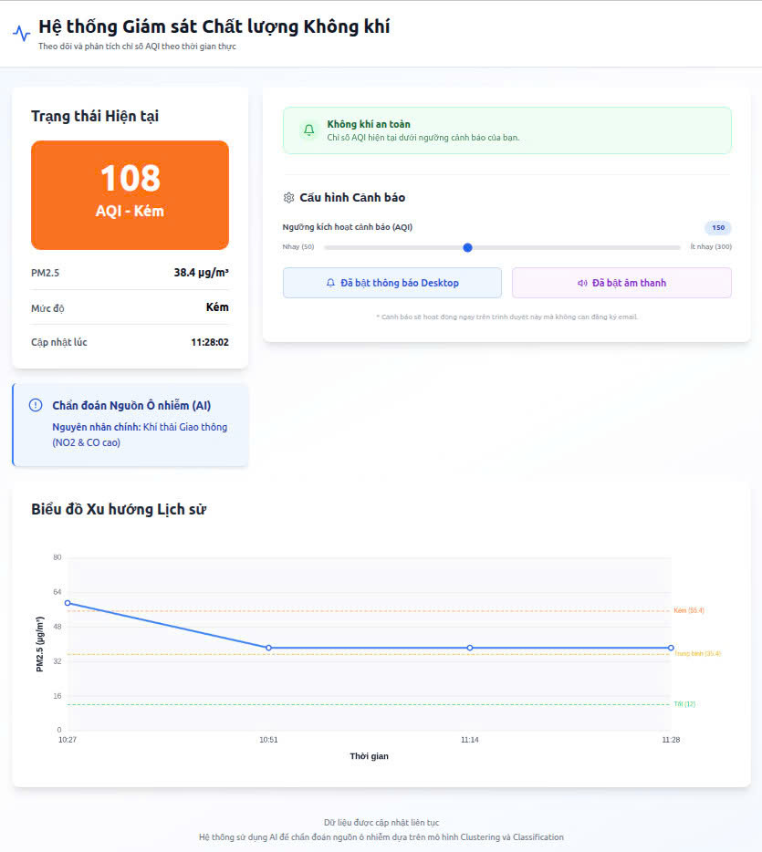

# 🌍 AI-Powered Air Quality Monitoring System

Hệ thống giám sát và cảnh báo chất lượng không khí (AQI) thông minh, tích hợp trí tuệ nhân tạo để chẩn đoán nguồn ô nhiễm và dự báo mức độ nguy hại. Dự án sử dụng các thuật toán Machine Learning (Random Forest, K-Means) để tự động phân tích, phân loại mức độ ô nhiễm, và hiển thị thông tin trực quan theo thời gian thực. Qua đó, người dùng có thể dễ dàng theo dõi chất lượng không khí, đồng thời nhận được các cảnh báo kịp thời nhằm bảo vệ sức khỏe.




## 📖 Giới thiệu

Dự án này thu thập dữ liệu ô nhiễm không khí theo thời gian thực (PM2.5, PM10, CO, NO2, O3, SO2), lưu trữ lịch sử, và sử dụng các mô hình Machine Learning để:
1.  **Phân loại mức độ ô nhiễm** (Classification - Random Forest).
2.  **Chẩn đoán nguồn gốc ô nhiễm** (Clustering - K-Means): Ví dụ do giao thông, xây dựng hay quang hóa.
3.  **Cảnh báo thông minh:** Hiển thị cảnh báo trực quan và âm thanh ngay trên trình duyệt.

## 🚀 Tính năng Chính

* **Real-time Dashboard:** Hiển thị chỉ số AQI, nồng độ bụi mịn và trạng thái hiện tại.
* **AI Diagnosis:** Tự động phân tích nguyên nhân ô nhiễm dựa trên tỷ lệ các chất khí.
* **Biểu đồ Lịch sử:** Theo dõi xu hướng biến động của PM2.5 theo thời gian.
* **Hệ thống Cảnh báo (Local Alert):**
    * Cảnh báo bằng Banner đỏ khi vượt ngưỡng.
    * Thông báo Desktop (Browser Notification).
    * Cảnh báo âm thanh.
* **Tự động hóa:** Backend tự động thu thập dữ liệu định kỳ (Scheduler) và cập nhật Database.

## 🛠️ Công nghệ Sử dụng

### Frontend
* **Framework:** React (Vite) + TypeScript
* **Styling:** Tailwind CSS
* **Icons:** Lucide React
* **Server:** Nginx (Production serving & Reverse Proxy)

### Backend
* **Framework:** Python Flask
* **Database ORM:** SQLAlchemy
* **Scheduler:** APScheduler (Tác vụ nền)
* **AI/ML:** Scikit-learn, Pandas, Joblib
* **Data Source:** OpenWeatherMap Air Pollution API

### Infrastructure
* **Database:** PostgreSQL 14
* **Containerization:** Docker & Docker Compose

## ⚙️ Cài đặt và Chạy thử (Deployment)

> 💡 **Dành riêng cho người mới bắt đầu trên hệ điều hành Windows:**
> Xem ngay tài liệu hướng dẫn cài đặt chi tiết từng bước (hỗ trợ cả Docker tự động và cài đặt thủ công) tại 👉 [HUONG_DAN_CAI_DAT_WINDOWS.md](file:///d:/Slide_THPT/AnhKhoa_AI/iotai_environmental_thpt/HUONG_DAN_CAI_DAT_WINDOWS.md).

### 1. Yêu cầu tiên quyết
* Cài đặt [Docker Desktop](https://www.docker.com/products/docker-desktop/) (hoặc Docker Engine + Compose).
* API Key từ OpenWeatherMap (Đã cấu hình sẵn trong code hoặc thay đổi trong `backend/config.py`).

### 2. Khởi chạy hệ thống
Mở Terminal tại thư mục gốc của dự án và chạy lệnh:

```bash
docker compose up --build
```

Quá trình thực hiện:

* Build Image cho Backend (Cài đặt thư viện Python, AI Models).

* Build Image cho Frontend (Build React App, cấu hình Nginx).

* Khởi tạo Database PostgreSQL.

### 3. Truy cập
* Sau khi build xong, truy cập trình duyệt tại: 👉 http://localhost:3000

* Frontend: http://localhost:3000

* API Endpoint (kiểm tra): http://localhost:3000/api/latest_aqi
## 📊 Dữ liệu & Quy trình Huấn luyện AI

Mô hình AI của hệ thống được xây dựng dựa trên quy trình khoa học dữ liệu chặt chẽ, sử dụng dữ liệu lịch sử thực tế để đảm bảo độ chính xác cao.

### 1. Nguồn Dữ liệu
* **Dataset:** Dữ liệu Chất lượng Không khí Việt Nam năm 2020.
    * Nguồn dữ liệu gốc: [Vietnam Open Development Mekong](https://data.vietnam.opendevelopmentmekong.net/dataset/timelines-dataset-on-air-quality-in-vietnam)
    * Dữ liệu trên Kaggle (sử dụng cho Notebook): [Kaggle Dataset](https://www.kaggle.com/datasets/ducnguyen168/dataset-on-air-quality-in-vietnam-in-2020)
* **Định dạng:** Time-series (Chuỗi thời gian) với các chỉ số ô nhiễm hàng ngày.
* **Các đặc trưng (Features) sử dụng:**
    * `PM2.5`: Bụi mịn (Yếu tố quan trọng nhất, trọng số ~62%).
    * `PM10`: Bụi thô.
    * `NO2`, `CO`, `SO2`, `O3`: Các khí thải độc hại.
    * `Month`, `DayOfWeek`, `DayOfYear`: Đặc trưng thời gian để bắt các mô hình chu kỳ/mùa vụ.

### 2. Quy trình Xử lý & Huấn luyện (Training Pipeline)
Toàn bộ quá trình được thực hiện trong `notebook_training_model_ai.ipynb`:

1.  **Tiền xử lý (Preprocessing):**
    * Chuyển đổi dữ liệu từ dạng *Long* sang *Wide* format.
    * Xử lý giá trị thiếu (Imputation) bằng giá trị trung bình.
    * Trích xuất đặc trưng thời gian (Feature Engineering).

2.  **Mô hình Chẩn đoán (Clustering):**
    * **Thuật toán:** K-Means Clustering.
    * **Mục tiêu:** Gom nhóm các ngày có đặc điểm ô nhiễm giống nhau thành 4 cụm (Cluster) để gán nhãn nguyên nhân (Ví dụ: Cụm có NO2 và CO cao thường do khí thải giao thông).
    * **Chuẩn hóa:** Sử dụng `StandardScaler` để đưa các chỉ số về cùng một thang đo trước khi phân cụm.

3.  **Mô hình Dự báo (Classification):**
    * **Thuật toán:** Random Forest Classifier.
    * **Mục tiêu:** Phân loại mức độ nguy hại của không khí (Tốt, Trung bình, Kém, Xấu, Nguy hại) dựa trên tổng hợp các chỉ số.
    * **Hiệu suất:** Độ chính xác (Accuracy) đạt **~99%** trên tập kiểm thử (Test set).

### 3. Kết quả Model
Các file model sau khi huấn luyện được lưu tại thư mục `weight/` để Backend sử dụng inference (dự đoán) theo thời gian thực:
* `scaler_clustering.joblib`: Bộ chuẩn hóa dữ liệu.
* `kmeans_diagnosis_model.joblib`: Model chẩn đoán nguyên nhân.
* `rf_classification_model.joblib`: Model phân loại mức độ.

## 🧠 Mô hình AI

Hệ thống sử dụng 2 mô hình đã được huấn luyện trước (Pre-trained models) đặt trong thư mục `weight/`:

1.  **Scaler (`scaler_clustering.joblib`):** Chuẩn hóa dữ liệu đầu vào.
2.  **K-Means (`kmeans_diagnosis_model.joblib`):**
    * Phân cụm dữ liệu ô nhiễm thành 4 nhóm.
    * **Input:** `[PM2.5, PM10, O3, NO2, SO2, CO]`
    * **Output:** Nhãn chẩn đoán (Ví dụ: "Khí thải giao thông").
3.  **Random Forest (`rf_classification_model.joblib`):**
    * Phân loại mức độ nguy hại chính xác.
    * **Output:** Mức độ (Tốt, Trung bình, Kém, Xấu, Nguy hại).

## 📂 Cấu trúc Dự án

```text
env_project/
├── backend/                # Source code Python Flask
│   ├── ai_service.py       # Logic xử lý AI
│   ├── app.py              # API Server & Scheduler
│   ├── config.py           # Cấu hình hệ thống & API Key
│   ├── data_fetcher.py     # Module lấy dữ liệu OpenWeatherMap
│   └── models.py           # Định nghĩa Database Models
├── frontend/               # Source code React TypeScript
│   ├── src/
│   │   ├── components/     # Các widget (Chart, Alert, Status...)
│   │   └── hooks/          # Logic gọi API
│   ├── Dockerfile          # Cấu hình build Frontend
│   └── nginx.conf          # Cấu hình Reverse Proxy
├── weight/                 # Chứa các file model AI (.joblib)
├── docker-compose.yml      # Orchestration toàn bộ hệ thống
├── Dockerfile              # Cấu hình build Backend
└── requirements.txt        # Các thư viện Python
```
## 🐛 Troubleshooting (Sửa lỗi thường gặp)
**Lỗi "401 Unauthorized" từ API**: 
* Kiểm tra lại API Key trong backend/config.py.

* Đảm bảo Key đã được kích hoạt (OpenWeatherMap thường mất 10-15p để kích hoạt key mới).

**Không thấy dữ liệu trên biểu đồ:**

* Chờ khoảng 1-2 phút sau khi khởi động để Scheduler chạy lần đầu tiên.

* Kiểm tra log backend: docker logs aqi_backend.

**Lỗi Database connection:**

* Thử reset lại volume docker: docker compose down -v sau đó up lại.
